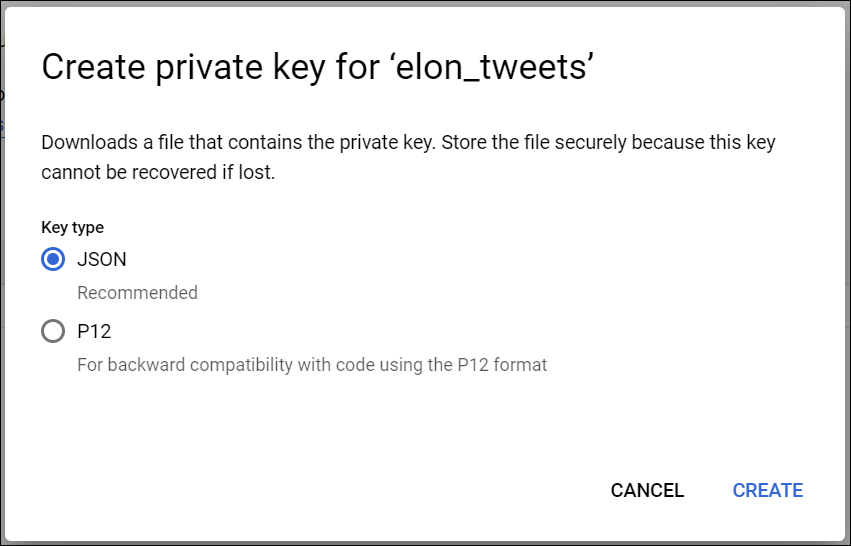

### _**Introduction**_
This project is aimed to analyze and visualize Elon Musk tweets from Jan 2022 to Oct 2022. The data used for this analysis is picked from **[Kaggle](https://www.kaggle.com/code/rajkumarpandey02/elon-musk-s-tweets-sentiment-analysis/data?select=cleandata.csv)**.

### _**Preparation**_
The following operations were performed on the data to prepare for the visualization.

**_Pre-Processing Steps:_**
- The tweets text were cleaned by performing below steps:

    a. Removing non-ASCII characters
    
    b. Fixing the quotes

    c. Expanding the contracted texts using - [pycontractions](https://pypi.org/project/pycontractions/)

    d. Removed the punctuations ignoring the digit separators using - _using regex negative lookahead pattern_ 
    
    `text = re.sub(r'[^\w\s%](?!\d)', ' ', text, flags=re.MULTILINE)`

    e. Removed stopwords

    f. Performed language detection and translation of non-english tweets using Google Cloud Translation API (more details below)

    g. Removed tweets with less than 2 words

### _**Processing**_

**_Emotions Classification:_**
- The Hugging Face :hugging_face: transformer was used to instantiate an open-source pre-trained model [Emanuel/bertweet-emotion-base](https://huggingface.co/Emanuel/bertweet-emotion-base) and tokenizer

- The transformer pipeline was used to classify the text into emotions - sadness, joy, love, anger , fear, surprise. [Demo Link](https://huggingface.co/spaces/Emanuel/twitter-emotions-demo)


**_Topic Extraction:_**
- Noun keyphrases were extracted using KeyBert
- Candidates key phrases were prepared using [CountVectorizer](https://maartengr.github.io/KeyBERT/guides/countvectorizer.html) and POS pattern `<NNP.*>+`
- Top 5 keyphrases were extracted for each tweet

**_Verbs and Adjectives extraction Steps :_**
- [flair](https://pypi.org/project/flair/0.11.3/) library was used to extract the verbs and adjectives part-of-speech from text 
- Before extracting different pos, verbs and adjectives were only extracted if the score was above 0.75

Finally the file was saved in the parquet file to be used by the streamlit application.

## Glossary

### Cloud Translation API setup

* Google Cloud Translation API must be enabled in the Google Cloud
* Create a Service Account in the "IAM and admin"
* Create a JSON key for the account and save it in a secure place

* Install the following python package to use the Google Translate API

```pip install google-cloud-translate```

* Set the environment variable `GOOGLE_APPLICATION_CREDENTIALS` as the location of the key file. For example, in a Jupyter Notebook Code cell, add following:

```
%env GOOGLE_APPLICATION_CREDENTIALS=C:\key.json
```
* Now the Translation client can be instantiated as follows:
```
# Google client object
client = translate.Client()
```